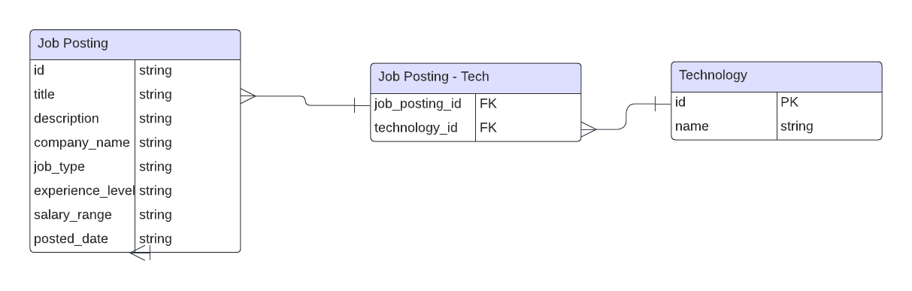

# Tech Connect 🚀

Welcome to **Tech Connect**, where we bridge the gap between talent and opportunity in the tech world! 👨‍💻🌐

## About

**Tech Connect** is a cutting-edge web application designed to revolutionize the way developers find their dream jobs and companies discover top-tier talent. With our sleek and intuitive interface, we provide a seamless platform for fullstack, frontend, and backend developers to explore exciting job postings tailored to their skills and preferences.

## Features

- **Job Postings:** Explore a wide range of job postings for fullstack, frontend, and backend developers.
- **Filterable Results:** Tailor your search and find the job that suits you with a UX that is designed with developers of all experience levels in mind. Also query for postings based on your tech stack of choice!

## Technologies Used

- **Frontend:** React.js
- **Backend:** Django
- **Database:** PostgreSQL

## Get Connected

Follow us on social media to stay updated with the latest news and developments:

- [Twitter](https://twitter.com/tech_connect_cv)
- [LinkedIn](https://www.linkedin.com/company/tech-connect_cv)
- [Facebook](https://www.facebook.com/techconnect_cv)

## ERD (Entity-Relationship Diagram)

## Feedback

Got feedback or suggestions? We'd love to hear from you! Open an [issue](https://github.com/CV2Tre/tech-connect/issues) or reach out to us directly.

## License

This project is licensed under the MIT License - see the [LICENSE](LICENSE) file for details.

---

🌟 **Tech Connect:** Connecting developers with their dream jobs! 🚀✨

